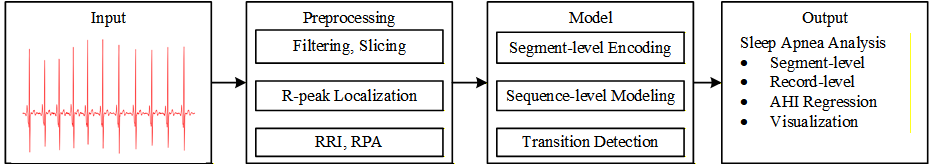
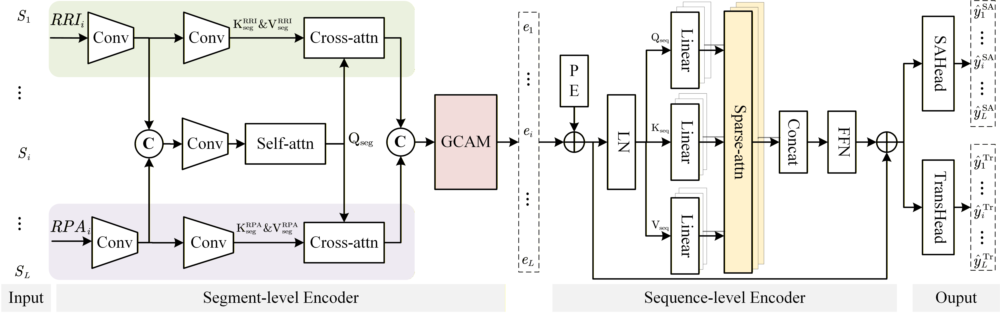

# ECG-Based Sleep Apnea Detection
DOI: https://doi.org/10.5281/zenodo.19199035
This repository contains an implementation for ECG-based sleep apnea detection using:

- RRI and RPA feature extraction from single-lead ECG
- a segment-level dual-branch encoder for local representation learning
- a grouped channel attention module for feature refinement
- a sequence-level sparse attention encoder for long-range temporal modeling
- a transition-aware auxiliary task for boundary-sensitive detection

The dataset can be downloaded from the links provided below.
- [Apnea-ECG](https://physionet.org/content/apnea-ecg/1.0.0/)
- [UCDDB](https://physionet.org/content/ucddb/1.0.0/)


## Figures

### Workflow



### Model Architecture



## Overview

The overall pipeline is:

1. Detect R-peaks from ECG
2. Build RRI and RPA signals
3. Resample features to fixed-length inputs
4. Group consecutive segments into long sequences
5. Train a many-to-many model for segment-wise apnea prediction and transition prediction

Main training entry points:

- `train_apnea_ecg.py`
- `train_ucddb.py`

Main model definition:

- `model/main_model.py`

## Repository Structure

```text
Project/
├─ dataset/                     # Prepared dataset files used by the training scripts
├─ metadata/                    # Metadata for Apnea-ECG record-level references
├─ model/                       # Main model components used by current training scripts
│  ├─ main_model.py             # Main model definition
│  ├─ seg_level_encoder.py      # Segment-level encoder
│  ├─ seq_level_encoder.py      # Sequence-level encoder
│  ├─ gcam.py                   # Group Channel Attention Module
│  └─ focal_loss.py             # Focal loss implementation for transition prediction
├─ result/                      # Example training outputs
├─ prepare_apnea_ecg.py         # Apnea-ECG preprocessing
├─ prepare_ucddb.py             # UCDDB preprocessing
├─ train_apnea_ecg.py           # Apnea-ECG training and evaluation
├─ train_ucddb.py               # UCDDB training and evaluation
├─ utils.py                     # Utility functions
└─ requirements.txt
```

## Environment

Recommended:

- Python 3.10 or later
- PyTorch with CUDA support if GPU training is needed

Install dependencies following requirements.txt:

```bash
conda create -n sleepapnea python=3.10
conda activate sleepapnea
pip install -r requirements.txt
```

## Data Preparation

### Apnea-ECG

Download the original dataset from PhysioNet:

- https://physionet.org/content/apnea-ecg/1.0.0/

Then update the raw data path inside [prepare_apnea_ecg.py](C:/Users/PC/Desktop/paper/SleepApneaDetection_GitHub/prepare_apnea_ecg.py) and run:

```bash
python prepare_apnea_ecg.py
```

This script prepares subject-level files under:

- `dataset/Apnea_ECG/train`
- `dataset/Apnea_ECG/test`

For subject-level evaluation, including AHI estimation and record-level sleep-disordered breathing detection, run:

```bash
python evaluate_recording.py --predictions result/apnea_ecg_sequence/test_predictions.csv --output-dir result/apnea_ecg_sequence/recording_eval
```


### UCDDB

Download the original dataset from PhysioNet:

- https://physionet.org/content/ucddb/1.0.0/

Then update the raw data path inside [prepare_ucddb.py](C:/Users/PC/Desktop/paper/SleepApneaDetection_GitHub/prepare_ucddb.py) and run:

```bash
python prepare_ucddb.py
```

This script prepares subject-level files under:

- `dataset/ucddb`

## Training

### Apnea-ECG

```bash
python train_apnea_ecg.py --seq-len 60 --epochs 300 --batch-size 128
```

Important defaults:

- sequence length(/minute): `60`
- train/validation split: last 5 training subjects are used as validation
- optimizer: `Adam`
- scheduler: `CosineAnnealingLR`
- auxiliary transition loss: enabled by default

Outputs are saved to:

- `result/apnea_ecg`


### UCDDB

```bash
python train_ucddb.py --fold-id 1 --seq-len 60 --epochs 300 --batch-size 128
```

Important defaults:

- sequence length(/minute): `60`
- split strategy: subject-level K-fold split
- validation and test sets are obtained by splitting the held-out fold
- optimizer: `Adam`
- scheduler: `CosineAnnealingLR`
- auxiliary transition loss: enabled by default

Outputs are saved to:

- `result/ucddb_sequence/fold_<id>`

## Evaluation
For subject-level evaluation, including AHI estimation and record-level sleep-disordered breathing detection, run:
```bash
python evaluate_recording.py
```

## Citation

If this repository contributes to your research, we would appreciate it if you cite the associated manuscript.
The citation information will be updated after formal publication or public preprint release.
